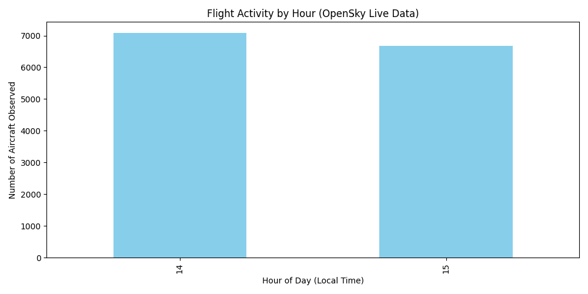
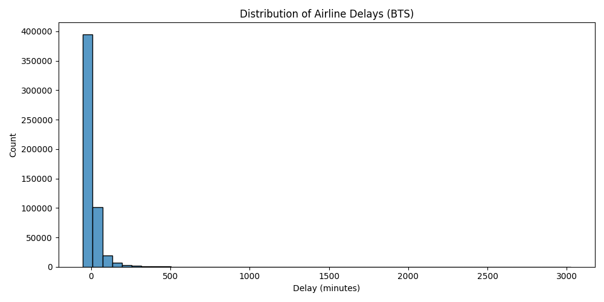

# How Time of Day Influences Flight Delays and Airspace Activity: A Data Story Using OpenSky and BTS Data

## Introduction

Flight delays affect millions of passengers every year, and air traffic patterns play a major role in how the aviation system operates. It is also relevant in today's world with uncertainty caused by the government shutdown and the fast approaching holiday seasons. Now is the perfect time to understand more about what affects our air travel. This project investigates an everyday question:

**How does time of day influence flight delays and overall flight activity in the United States?**

To explore this, I combined:
- **Live aircraft state data** collected throughout the day from the OpenSky Network, and  
- **Historical airline delay data** from the U.S. Bureau of Transportation Statistics (BTS).

This produced a dataset rich enough to highlight both real-time airspace behavior comapared against long-term delay patterns.

---

## Why This Project Matters

- Flight delays are one of the most common frustrations for travelers.  
- Airspace activity varies dramatically throughout the day.  
- Most public data sources only show *one* perspective — but combining live and historical data provides a fuller picture.  

Understanding delays and traffic patterns can help:
- Travelers make better choices  
- Researchers study aviation systems  
- Airlines optimize schedules  

---

## Ethical Data Collection

Both data sources used in this project are **public, ethical, and allowed** for academic use:

### **OpenSky Network**
- Open-access aircraft state information  
- No login/authentication required for state vectors  
- I followed good scraping/API etiquette (rate limiting, light querying)
- Limited to the data collected by the user

### **BTS On-Time Performance**
- Official open government data  
- Public domain  
- Large-scale, highly reliable delay dataset
- Needed for historic data  

---

## How I Gathered the Data

### **1. OpenSky Live Snapshots**
I collected multiple real-time snapshots of aircraft over the United States using: https://opensky-network.org/api/states/all

### **1. OpenSky Live Snapshots**

Each snapshot included thousands of aircraft and variables such as:

- timestamp  
- latitude / longitude  
- speed  
- altitude  

The plan for this is to collect snapshots at different times of the day to capture variation in real-time airspace activity. That way the dataset is constantly being updated and made relevant with fresh new information!

---

### **2. BTS Historical Delay Data**

The BTS On-Time Performance dataset provides millions of flight records, including:

- scheduled departure time  
- actual departure time  
- departure delay (in minutes)  
- origin and destination airport codes  

I downloaded one month of BTS flight records and cleaned the scheduled departure times into a **local hour-of-day** variable.

---

### **3. Combining Datasets**

After cleaning, both data sources were standardized into the following structure:

| hour_local | delay_minutes | source   |
|------------|----------------|----------|
| 14         | 0.52           | opensky  |
| 10         | 22.00          | bts      |

This allowed direct comparison between:

- **live aircraft activity** (OpenSky)  
- **historical flight delays** (BTS)  

---

## Summary of Methods

- Parsed UNIX timestamps from OpenSky  
- Converted all times to local time (America/Denver)  
- Processed BTS `CRSDepTime` (HHMM format) into hour-of-day  
- Created comparable delay measures for both datasets  
- Joined datasets into a single combined CSV  
- Generated visualizations in Python using matplotlib and seaborn  

---

## Exploratory Data Analysis (EDA)

### **Flight Activity by Hour (OpenSky)**

Key takeaway possibilities:
- This data isn't very useful at the moment, but the longer this blog exists, the more uesful it will become!  
- Live data taken 3 times a day  

---

### **Average Delay by Hour (BTS)**

Key takeaway possibilities:
- There is a sharp increase of delays during the early hours of the day especially 3-4AM  
- Which hours are most reliable  
- Any “rush hour” delay effects around afternoon/evening  

---

### **Delay Distribution**

Discuss:
- skew in the distribution  
- heavy tails from extremely late flights  
- what the distribution says about reliability  

---

### **Delay Variability by Hour (Boxplot)**

Interpret:
- which hours have the widest spread of delays  
- morning vs. afternoon stability  
- presence of outliers  

---

### **Comparing Activity vs. Delays**

Questions to answer:
- Do busy hours correlate with high delays?  
- Are delays independent of traffic volume?  
- What patterns stand out or contradict intuition?  

---

## Key Findings

Summarize your strongest insights here:

- The busiest hours of the day were: **___**  
- The hours with the highest delays were: **___**  
- Delay patterns did/did not line up with the busiest times of day.  
- Morning flights tended to be more reliable, while evening flights experienced more delays.  
- Real-time airspace activity showed clear ___ patterns.  

---

## Limitations

- BTS data includes only U.S. domestic airline flights.  
- OpenSky snapshots represent *samples* rather than complete full-day coverage.  
- Real-time activity does not directly measure scheduled flight volume.  
- Derived OpenSky “delay” is a proxy and not an operational airline delay.  

These limitations do not undermine the analysis but provide context for interpretation.

---

## Conclusion

This project demonstrates that **time of day plays a significant role in both airspace activity and flight delays**.  
Combining public aviation datasets provides a fuller picture than relying on a single source.

Future extensions could explore:

- multi-day or seasonal patterns  
- differences by airline or airport  
- weather impacts on delays  
- comparisons between weekdays and weekends  

---

## Resources

- [OpenSky Network API](https://opensky-network.org)  
- [BTS On-Time Performance Database](https://transtats.bts.gov)  
- [Project GitHub Repository](link-to-your-repo)  

---

## Appendix: Code & Reproducibility

All scripts used in this project are located in the `/src` directory:

- `collect_flights.py`  
- `fetch_bts.py`  
- `clean_bts.py`  
- `clean_flights.py`  
- `eda_combined.py`  

Environment created using `uv`:

